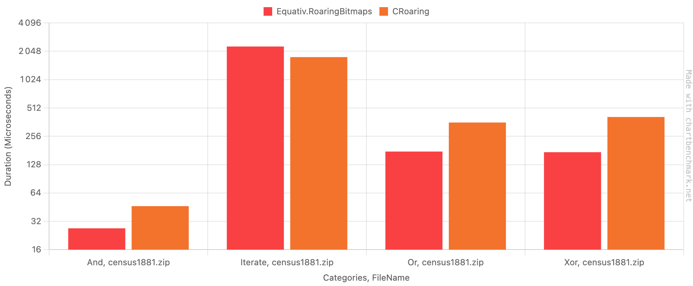

# Equativ.RoaringBitmaps

Equativ.RoaringBitmaps is a pure C# implementation of [RoaringBitmap](http://roaringbitmap.org).
- ✨ **Fully managed code!** No risk of segfaults or memory leaks due to missed disposals.
- 🚀 **Blazingly fast!** See [benchmarks](#performance).

## Usage

```sh
dotnet add package Equativ.RoaringBitmaps
```
Example usage:
```csharp
// Create bitmaps
var a = RoaringBitmap.Create([1, 2, 3, 4, 5]);
var b = RoaringBitmap.Create([4, 5, 6, 7]);

// Compute AND (also)
var and = a & b;
//var or = a | b;
//var xor = a ^ b;
//var not = ~a;

// Retreive
int[] result = and.ToArray(); // [4, 5]
```

## Performance

Here are some performance benchmarks. Make sure to run the benchmarks on your own hardware and in your own context/environment to get more meaningful results.  
Benchmarks include numbers on [Roaring.Net](https://github.com/k-wojcik/Roaring.Net), which is a C# wrapper around the "official" [CRoaring](https://github.com/RoaringBitmap/CRoaring) written in C.  

Charts are generated using [chartbenchmark.net](https://chartbenchmark.net/).

### Macbook pro M1 (ARM64)


### How can this be faster than the C implementation?

Several reasons can explain why this benchmark numbers are sometimes in favor of this implementation:
- [Roaring.Net](https://github.com/k-wojcik/Roaring.Net) is wrapper, which means that there is a marshalling cost between C# and C.
- This implementation has a few optimizations that are not present in the C implementation.
- Modern C# is perform really well for this kind of workloads.