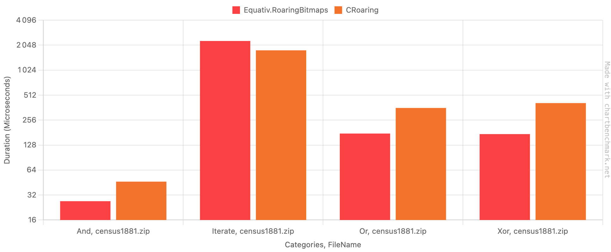

# Equativ.RoaringBitmaps

Equativ.RoaringBitmaps is a pure C# implementation of [RoaringBitmap](http://roaringbitmap.org).
- ✨ **Fully managed code!** No risk of segfaults or memory leaks due to missed disposals.
- 🚀 **Blazingly fast!** See [benchmarks](#performance).
-  **Portable**: It works everywhere where .NET is supported.

## Usage

```sh
dotnet add package Equativ.RoaringBitmaps
```
Example usage:
```csharp
// Create bitmaps
var a = RoaringBitmap.Create([1, 2, 3, 4, 5]);
var b = RoaringBitmap.Create([4, 5, 6, 7]);

// Compute 'and' between bitmaps
var and = a & b;
//var or = a | b;
//var xor = a ^ b;
//var not = ~a;

// Retreive
int[] result = and.ToArray(); // [4, 5]
```

The operators leave their operands untouched and allocate a new bitmap. When that is not needed, the in-place variants modify the bitmap itself and avoid most allocations, e.g. to fold many bitmaps into one:
```csharp
var acc = RoaringBitmap.Create();
foreach (var bitmap in bitmaps)
{
    acc.OrInPlace(bitmap); // also AndInPlace, XorInPlace, AndNotInPlace and NotInPlace
}
```
Bitmaps may share storage behind the scenes (copy on write), so an in-place operation never affects another bitmap, and `Clone()` gives a cheap copy that can be modified independently.

## Performance

Here are some performance benchmarks. Make sure to run the benchmarks on your own hardware and in your own context/environment to get more meaningful results.  
Benchmarks include numbers on [Roaring.Net](https://github.com/k-wojcik/Roaring.Net), which is a C# wrapper around the "official" [CRoaring](https://github.com/RoaringBitmap/CRoaring) written in C.  

Charts are generated using [chartbenchmark.net](https://chartbenchmark.net/).

### Macbook pro M1 (ARM64)
  
(lower is better)

## F.A.Q.

### How can this be faster than the C implementation?

There can be a few reasons:
- Modern C# performs really well for this kind of workloads, it shall not be underestimated.
- [Roaring.Net](https://github.com/k-wojcik/Roaring.Net) is wrapper, which means that there is a marshalling cost between C# and C.
- This implementation has a few optimizations that are not present in the C implementation, especially for ARM CPUs.
